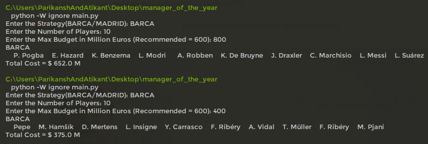
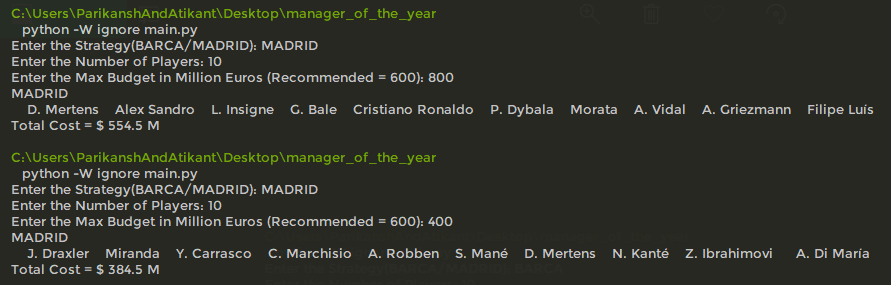
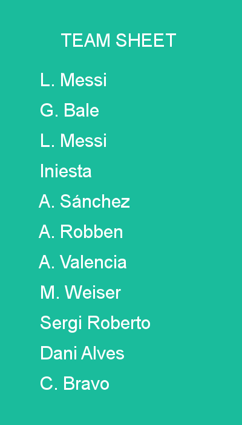

# managerOfTheYear
This uses Genetic Algorithm concept to give you a set of players, best suited for a given 'strategy' and a budget constraint. The 'Strategy' consists of 'Scores' for a each 11 features used; sum of 'Scores' being 100.

## ToDo
1. ~~Categorise players into 'Forward', 'Mid-Fielder', 'Defender', 'Goal Keeper'~~
2. ~~Implement CrossOver~~
3. Prevent Duplicate Players

### Team according to Barcelona Strategy: (Includes Messi :p)

### Team according to Madrid Strategy: (Includes Ronaldo :p)

### Generated Team Sheet Image

